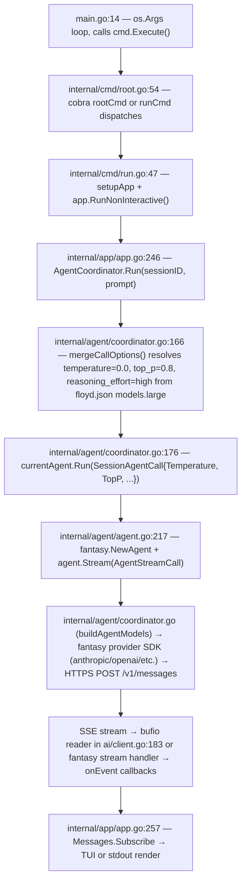

# Floyd Harness — SURGICAL Mode (EXTREME DETERMINISTIC CODER)

**Variant:** SURGICAL — the EXTREME DETERMINISTIC CODER  
**Trigger:** `SURGICAL <task>` in any user prompt  
**One-line purpose:** Activates the smallest-safe-change-only protocol where temperature=0.0 + reasoning_effort=high eliminate sampling variation and maximize patch safety.

---

## How to Trigger

Prepend `SURGICAL` to your task description:

```
SURGICAL fix the nil-pointer in internal/agent/agent.go:274
SURGICAL rename variable `temp` to `temperature` in coordinator.go only
```

Floyd detects the keyword and shifts to SURGICAL mode rules automatically.

---

## Query → API Flowchart



---

## Config Block — SURGICAL Parameters

Located at `floyd.json:11-19`:

```json
"models": {
  "large": {
    "model": "claude-sonnet-4-20250514",
    "provider": "z-ai",
    "temperature": 0.0,
    "top_p": 0.8,
    "reasoning_effort": "high"
  }
}
```

### Why temperature=0.0 + reasoning_effort=high = EXTREME DETERMINISTIC profile

- `temperature=0.0`: Collapses the output distribution to a single greedy-argmax token at every step. Zero sampling variation means identical prompts yield identical outputs across runs — the precondition for safe, auditable patches.
- `top_p=0.8`: Nucleus sampling gate retained as a secondary constraint. At temp=0 it is largely inert but prevents edge-case float rounding from ever sampling outside the top-80% probability mass.
- `reasoning_effort=high`: Routes through extended chain-of-thought on providers that support it (Anthropic extended thinking, OpenAI o-series). More reasoning budget means the model evaluates patch scope, edge cases, and rollback risk before generating any output — the correct tradeoff when you are paying for determinism rather than speed.

Combined effect: maximum reproducibility (temp=0) + maximum pre-generation analysis (reasoning=high). This is the correct profile for high-risk edits where a wrong token causes a regression.

---

## Adjacent Mode Shift Flags

Each mode is activated by its keyword prefix. To shift out of SURGICAL back to another mode, use the corresponding keyword:

| Mode | Trigger | Purpose |
|---|---|---|
| KICKOFF | `KICKOFF <task>` | Project initialization, first-session orientation |
| COMPLEX | `COMPLEX <task>` | Multi-file orchestration with full planning phase |
| STABILITY | `STABILITY <task>` | Regression hardening — test-first, no new features |
| 10X POWER | `10X POWER <task>` | Maximum output velocity, parallel tool use |
| FORENSIC | `FORENSIC <task>` | Read-only investigation, no writes until root cause confirmed |
| CREATIVE | `CREATIVE <task>` | Exploratory or generative work, relaxed constraints |

See `internal/agent/templates/deterministic/` for the full prompt skeletons backing each mode.

---

## Rollback Cookbook

### Undo 1 — Remove SURGICAL overlay from system prompt template

File: `internal/agent/templates/floyd-general.md.tpl`  
Added block starts at the line `## DETERMINISTIC MODE`.

```bash
# Remove the appended block (everything from ## DETERMINISTIC MODE to end of file)
# Backup current state first:
cp /Volumes/Storage/floyd-v5-backup-2026-04-16/internal/agent/templates/floyd-general.md.tpl \
   /Volumes/Storage/floyd-v5-backup-2026-04-16/internal/agent/templates/floyd-general.md.tpl.bak

# Edit to remove the overlay: delete from line 36 onward (the ## DETERMINISTIC MODE block)
# Restore from git if in a repo:
#   git checkout internal/agent/templates/floyd-general.md.tpl
```

Verification: `grep -c "SURGICAL" internal/agent/templates/floyd-general.md.tpl` should return 0.

### Undo 2 — Remove SURGICAL model config from floyd.json

File: `floyd.json`  
Added block is the `"models"` key (lines 11-19 in the modified file).

```bash
cp /Volumes/Storage/floyd-v5-backup-2026-04-16/floyd.json \
   /Volumes/Storage/floyd-v5-backup-2026-04-16/floyd.json.bak

# Remove the "models": { ... } block (9 lines) from floyd.json
# Or restore from git:
#   git checkout floyd.json
```

Verification: `grep -c "temperature" floyd.json` (top-level models block) should return 0.

### Undo 3 — Remove this README

```bash
rm /Volumes/Storage/floyd-v5-backup-2026-04-16/README.FLOYD_SURGICAL.md
```

---

## Citations

| Item | Path | Line |
|---|---|---|
| CLI entry point | `main.go` | 14 |
| Cobra root command | `internal/cmd/root.go` | 54 |
| run subcommand dispatch | `internal/cmd/run.go` | 47 |
| RunNonInteractive | `internal/app/app.go` | 150 |
| mergeCallOptions (temp/topP resolution) | `internal/agent/coordinator.go` | 382–390 |
| SessionAgentCall dispatch | `internal/agent/coordinator.go` | 176 |
| fantasy.NewAgent + Stream | `internal/agent/agent.go` | 217, 274 |
| HTTP SSE stream loop | `internal/ai/client.go` | 183 |
| SelectedModel config struct | `internal/config/config.go` | 76–98 |
| System prompt template | `internal/agent/templates/floyd-general.md.tpl` | 1–57 |
| SURGICAL overlay appended | `internal/agent/templates/floyd-general.md.tpl` | 36 |
| Model config block | `floyd.json` | 11–19 |
